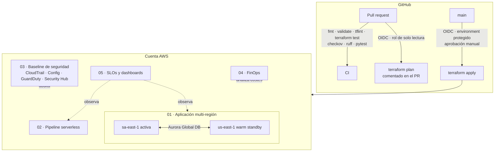

# AWS Cloud Engineering Portfolio

**Johan Romero Aguirre** · Ingeniero DevOps / Cloud senior · ~10 años en banca, seguros y energía

Infraestructura en AWS escrita como la escribiría para producción: Terraform modular, Lambda en Python con tests, seguridad desde el diseño, FinOps y observabilidad basada en SLOs. Cada proyecto explica **por qué** se tomó cada decisión, no solo cómo desplegarlo.

[](../../actions/workflows/ci.yml)


---

## Proyectos

| # | Proyecto | Qué demuestra | Servicios |
|---|---|---|---|
| 01 | [Multi-región HA/DR (warm standby)](projects/01-multi-region-ha-dr) | RPO < 1 min y RTO < 15 min entre dos regiones, runbook de failover y game day | EC2, ALB, ASG, Aurora Global Database, Route 53, WAF, Secrets Manager, KMS |
| 02 | [Pipeline serverless de pedidos](projects/02-serverless-order-pipeline) | Lambda en Python idempotente, fan-out SNS → SQS, fallos parciales de lote, 22 tests | Lambda, S3, EventBridge, SQS, SNS, DynamoDB, X-Ray |
| 03 | [Baseline de seguridad y gobierno](projects/03-security-baseline) | Auditoría inmutable, detección, cumplimiento continuo, alertas CIS, permissions boundary, SCPs | CloudTrail, Config, GuardDuty, Security Hub, Access Analyzer, KMS |
| 04 | [FinOps automatizado](projects/04-finops-automation) | Presupuestos, anomalías de coste y un escáner semanal de recursos ociosos con ahorro estimado | Budgets, Cost Anomaly Detection, Lambda, EventBridge Scheduler |
| 05 | [Observabilidad basada en SLOs](projects/05-observability) | Alertas por tasa de consumo del presupuesto de error, dashboard, Logs Insights y ELK gestionado | CloudWatch, OpenSearch, Data Firehose |

Base compartida: [módulo `vpc`](modules/vpc) (3 capas, NAT por AZ), [módulo `app-stack`](modules/app-stack) (ALB + ASG + WAF) y [`bootstrap`](bootstrap) (estado remoto en S3 con bloqueo nativo y roles OIDC para GitHub Actions).

## Arquitectura de referencia



## Cómo cubre cada requisito del puesto

| Requisito | Dónde verlo |
|---|---|
| Evolución de arquitectura, alta disponibilidad y resiliencia | [01](projects/01-multi-region-ha-dr) · [ADR-0002](docs/adr/0002-warm-standby-dr.md) · [game day](projects/01-multi-region-ha-dr/runbooks/game-day.md) |
| IaC estandarizada, trazable y auditable | Módulos reutilizables, backend parcial, `terraform test`, plan en cada PR, apply con aprobación · [ADR-0001](docs/adr/0001-terraform-y-convivencia-con-cloudformation.md) |
| Gobierno y seguridad continua (IAM, KMS) | [03](projects/03-security-baseline) · mínimo privilegio en cada rol · [ADR-0003](docs/adr/0003-github-oidc.md) |
| Madurez FinOps y eficiencia operativa | [04](projects/04-finops-automation) · etiquetas `CostCenter` en todo · NAT única en entornos no productivos |
| Gestión proactiva de incidentes | [05](projects/05-observability) · [ADR-0004](docs/adr/0004-alertas-por-slo.md) · [runbooks](docs/runbooks) · [plantilla de postmortem](docs/postmortem-template.md) |
| Networking (VPC, subredes) | [módulo vpc](modules/vpc) |
| Lambda en Python | [02](projects/02-serverless-order-pipeline) · [04](projects/04-finops-automation) |
| Monitoreo y logs (CloudWatch, ELK) | [05](projects/05-observability) · OpenSearch vía Data Firehose |
| CI/CD | [`.github/workflows`](.github/workflows) |

## Calidad: lo que valida la CI en cada PR

| Control | Herramienta | Resultado actual |
|---|---|---|
| Formato y sintaxis | `terraform fmt`, `terraform validate` | 8 raíces/módulos válidos |
| Lógica de la infraestructura | `terraform test` con proveedores simulados | 12 tests (sin credenciales de AWS) |
| Buenas prácticas | TFLint + ruleset AWS | — |
| Seguridad de la IaC | Checkov (Terraform, Actions, secretos) | 0 fallos; cada excepción justificada en código o en [`.checkov.yaml`](.checkov.yaml) |
| Código Python | Ruff + pytest con `moto` | 35 tests |

## Estructura

```
.
├── bootstrap/            # Estado remoto + OIDC para GitHub Actions (una vez por cuenta)
├── modules/
│   ├── vpc/              # VPC de 3 capas, con tests
│   └── app-stack/        # ALB + ASG + WAF + IMDSv2
├── projects/
│   ├── 01-multi-region-ha-dr/
│   ├── 02-serverless-order-pipeline/
│   ├── 03-security-baseline/
│   ├── 04-finops-automation/
│   └── 05-observability/
├── docs/
│   ├── adr/              # Registro de decisiones de arquitectura
│   ├── runbooks/
│   └── postmortem-template.md
├── site/                 # Web del portfolio (GitHub Pages)
└── .github/workflows/    # CI, plan/apply con OIDC, Pages
```

## Ejecutar en local

```bash
make test        # terraform test + pytest (no necesita cuenta de AWS)
make lint        # fmt, validate, tflint, ruff
make security    # checkov
```

Para desplegar: sigue [`bootstrap/README.md`](bootstrap/README.md) y después el README de cada proyecto. Todos los proyectos generan coste real en AWS; están pensados para desplegarse, probarse y destruirse.

## Sobre mí

Ingeniero DevOps/Cloud con experiencia en NTT Data, Indra (Centro de Excelencia DevSecOps), Smartjob, Slashmobility y Zoluxiones, entre otras. Trabajo habitual con Kubernetes (EKS, AKS, OpenShift), Terraform, Terragrunt, Ansible, CI/CD y Python. Certificaciones: AWS Cloud Practitioner, AZ-104, AZ-305, AZ-700, AZ-140, AZ-900 y LPIC-1.

Web del portfolio: <https://jromeroa94.github.io/aws-cloud-portfolio/> · Consultora: [nimbodev.com](https://nimbodev.com)

---

<sub>Licencia MIT. Los proyectos son implementaciones de referencia construidas para este portfolio, no copias de infraestructura de clientes.</sub>
