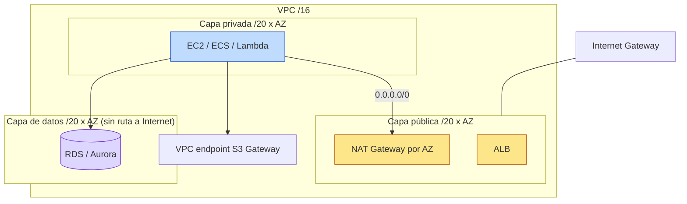

# Módulo `vpc`

VPC de tres capas lista para producción, reutilizada por todos los proyectos del portfolio.



## Decisiones de diseño

| Decisión | Motivo |
|---|---|
| Una tabla de rutas privada **por AZ** | Cada AZ sale por su propia NAT: si cae una AZ, las demás siguen con salida a Internet y no se paga transferencia inter-AZ hacia la NAT. |
| `nat_gateway_mode = "single"` para dev | Una NAT por AZ cuesta ~US$ 32/mes cada una más tráfico; en dev el ahorro compensa la pérdida de HA. |
| Capa `data` sin ruta por defecto | Las bases de datos nunca necesitan salir a Internet; se reduce la superficie de exfiltración. |
| Endpoint Gateway de S3 activado por defecto | Es gratuito y evita que el tráfico a S3 pase por la NAT (que cobra por GB procesado). |
| Security group por defecto sin reglas | Fuerza a que cada carga de trabajo declare su propio SG con mínimo privilegio. |
| `map_public_ip_on_launch = false` | Nada recibe IP pública por accidente; solo ALB y NAT exponen IPs. |
| Flow Logs a CloudWatch con retención configurable | Auditoría de red y análisis forense; la retención acota el coste. |

## Uso

```hcl
module "vpc" {
  source = "../../modules/vpc"

  name             = "app-prod-scl"
  cidr_block       = "10.10.0.0/16"
  az_count         = 3
  nat_gateway_mode = "per_az"
  tags             = { Environment = "prod" }
}
```

## Entradas principales

| Variable | Tipo | Por defecto | Descripción |
|---|---|---|---|
| `name` | string | — | Prefijo de nombres |
| `cidr_block` | string | — | CIDR de la VPC |
| `az_count` | number | `3` | AZs a usar (2–4) |
| `nat_gateway_mode` | string | `per_az` | `per_az`, `single` o `none` |
| `enable_s3_gateway_endpoint` | bool | `true` | Endpoint Gateway de S3 |
| `flow_logs_retention_days` | number | `30` | `0` desactiva Flow Logs |

## Salidas

`vpc_id`, `public_subnet_ids`, `private_subnet_ids`, `data_subnet_ids`, `private_route_table_ids`, `nat_public_ips`, `azs`.
