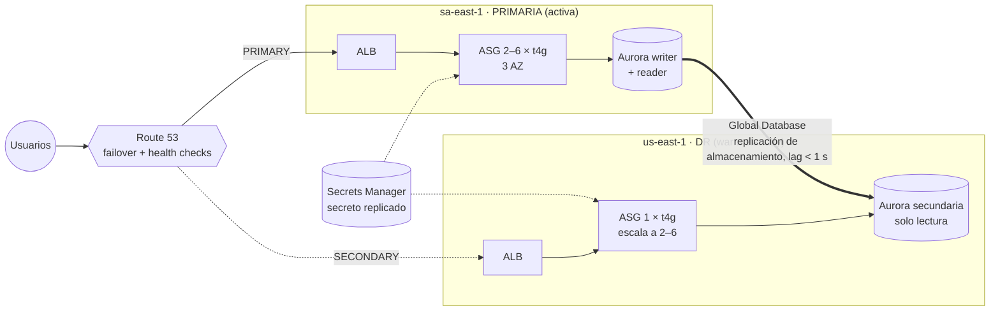

# 01 · Multi-región con alta disponibilidad y DR (warm standby)

Aplicación web en EC2 detrás de un ALB, con Aurora PostgreSQL, desplegada en **dos regiones** con estrategia **warm standby** para cumplir **RPO < 1 min** y **RTO < 15 min**.

> Requisitos del puesto que cubre: *Infraestructura multi-región y alta disponibilidad*, *Terraform*, *EC2, RDS, VPC, IAM, CloudWatch, Route 53*, *networking (subredes, VPC)*, *seguridad (cifrado, mínimo privilegio)*.

## Arquitectura



## Por qué warm standby

| Estrategia | RPO típico | RTO típico | Coste relativo | ¿Cumple RPO < 1 min y RTO < 15 min? |
|---|---|---|---|---|
| Backup & restore | horas | horas | $ | No |
| Pilot light | segundos–minutos | decenas de minutos (hay que arrancar el cómputo) | $$ | Arriesgado para el RTO |
| **Warm standby** | **segundos** | **minutos** | $$$ | **Sí** |
| Activo-activo | ~0 | ~0 | $$$$ | Sí, pero con sobrecoste y complejidad de escritura multi-región |

La decisión completa está en [ADR-0002](../../docs/adr/0002-warm-standby-dr.md).

## Decisiones técnicas destacables

- **Aurora Global Database**: replica a nivel de almacenamiento con lag normalmente inferior a un segundo, y permite *switchover* (planificado, sin pérdida de datos) y *failover* (emergencia).
- **Contraseña maestra sin rastro en el estado**: se genera con un recurso `ephemeral` y se pasa por atributos *write-only* (`master_password_wo`, `secret_string_wo`). Rotarla es incrementar `db_password_version`.
- **Secreto replicado a DR**: la aplicación de la región secundaria no depende de la primaria para obtener credenciales.
- **El RPO se vigila, no se supone**: alarma sobre `AuroraGlobalDBReplicationLag`.
- **Route 53 failover** con health checks desde tres regiones de AWS y `evaluate_target_health`.
- **Sin SSH**: acceso a instancias por SSM Session Manager; IMDSv2 obligatorio; EBS cifrado.
- **Despliegues sin downtime**: `instance_refresh` rolling con rollback automático.
- **Coste de la espera acotado**: DR corre con 1 instancia, 1 NAT y 1 instancia de Aurora.
- **Terraform no pelea con el runbook**: `ignore_changes` en `desired_capacity` y en los identificadores de replicación que cambian tras un failover.

## Uso

```bash
cd projects/01-multi-region-ha-dr
cp terraform.tfvars.example terraform.tfvars
terraform init -backend-config="bucket=$TF_STATE_BUCKET" -backend-config="region=sa-east-1"
terraform plan -out=tfplan
terraform apply tfplan
terraform output failover_commands
```

> ⚠️ Este stack levanta recursos con coste real (NAT Gateways, ALB, Aurora `db.r6g.large` en dos regiones). Para un laboratorio, aplícalo, prueba el failover y destrúyelo el mismo día (`deletion_protection = false`). Estima el coste antes con la [AWS Pricing Calculator](https://calculator.aws/).

## Operación

- [Runbook de failover y failback](runbooks/failover.md)
- [Game day: cómo probar el DR](runbooks/game-day.md)
