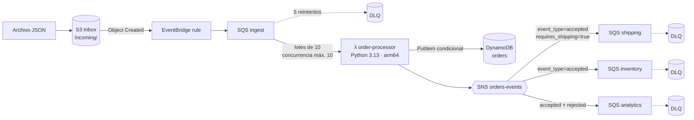

# 02 · Pipeline serverless de pedidos (Lambda Python, fan-out SNS → SQS)

Los pedidos llegan como archivos JSON a S3. Una Lambda en Python los valida, los registra de forma **idempotente** en DynamoDB y publica un evento que se reparte (**fan-out**) a los servicios de envíos, inventario y analítica, cada uno con su propia cola y su DLQ.

> Requisitos del puesto que cubre: *AWS Lambda (Python)*, *arquitecturas serverless*, *S3, IAM, CloudWatch*, *seguridad: control de acceso, cifrado y auditoría*, *Terraform*.

## Arquitectura



## Decisiones de diseño

| Problema | Solución | Por qué |
|---|---|---|
| Varios servicios necesitan cada pedido, con distinta disponibilidad | **SNS + una cola SQS por consumidor** | Un consumidor caído no bloquea a los demás; su cola guarda los mensajes hasta 4 días. |
| Cada consumidor solo quiere ciertos eventos | **Filter policies** sobre atributos del mensaje | Envíos no recibe pedidos digitales; la Lambda no necesita conocer a los consumidores. |
| Duplicados (S3 y SQS entregan *al menos una vez*) | `PutItem` con `attribute_not_exists(order_id)` + marca `event_published` | Un duplicado no genera un segundo evento; si SNS falla después de escribir, el reintento completa la publicación. |
| Un mensaje malo no debe reprocesar el lote entero | `ReportBatchItemFailures` | Solo vuelven a la cola los mensajes con fallo **transitorio**. |
| Pedidos inválidos | Evento `order.rejected`, sin reintento | Reintentar un JSON corrupto solo gasta dinero; analítica los registra para revisión. |
| Picos de carga | `maximum_concurrency` en el event source mapping | Protege a DynamoDB y a los consumidores sin usar concurrencia reservada. |
| Mensajes "en vuelo" duplicados | `visibility_timeout = 6 × timeout` de la Lambda | Recomendación de AWS para SQS → Lambda. |
| Importes monetarios | `Decimal`, redondeo por moneda (CLP sin decimales) | Nunca `float` para dinero. |
| Cifrado | Una CMK del proyecto con rotación para S3, SQS, SNS, DynamoDB y logs | La key policy autoriza explícitamente a EventBridge y SNS a cifrar en colas protegidas. |
| Permisos | Una política por recurso concreto (`incoming/*`, una tabla, un tema) | Mínimo privilegio verificable en revisión. |

## Pruebas

22 tests con `pytest` + `moto` (AWS simulado en memoria): validación, cálculo de totales, idempotencia, fallos transitorios parciales, recuperación cuando SNS falla tras escribir, y claves S3 con espacios en los dos formatos de evento.

```bash
pip install -r requirements-dev.txt
pytest -q
```

## Despliegue y prueba

```bash
terraform init -backend-config="bucket=$TF_STATE_BUCKET" -backend-config="region=sa-east-1"
terraform apply
terraform output try_it   # sube un pedido de ejemplo y consulta el resultado
```

Consulta útil en CloudWatch Logs Insights:

```
fields @timestamp, message, order_id, reason
| filter level = "WARNING" or message = "pedido rechazado"
| sort @timestamp desc
| limit 50
```
