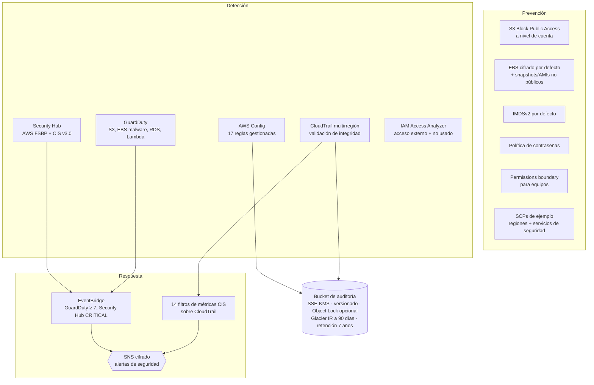

# 03 · Baseline de seguridad y gobierno de cuenta AWS

Línea base de seguridad que se aplica a cada cuenta nueva **antes** de desplegar cargas de trabajo: registro de auditoría inmutable, detección de amenazas, evaluación continua de cumplimiento y alertas accionables.

> Requisitos del puesto que cubre: *Gobierno y seguridad continua (IAM, KMS)*, *seguridad en la nube: control de acceso, cifrado y auditoría*, *preparar la plataforma para estándares de la industria*.

## Qué incluye



## Decisiones destacables

- **Una clave KMS de auditoría** con política explícita por servicio y condiciones `aws:SourceArn` / `aws:SourceAccount`, para evitar el problema del *confused deputy*.
- **CloudTrail con `enable_log_file_validation`**: los digest firmados permiten demostrar que ningún log fue alterado.
- **Object Lock en modo GOVERNANCE** (activable): ni un administrador puede borrar logs sin el permiso explícito de *bypass*.
- **Security Hub con `SECURITY_CONTROL`**: un único hallazgo por control aunque aplique a varios estándares, lo que reduce el ruido.
- **Alertas legibles**: el `input_transformer` convierte el JSON de GuardDuty en una frase que se entiende desde el móvil.
- **El umbral de `unauthorized-api-calls` es 10** y no 1: las denegaciones aisladas son normales y una alarma que siempre suena se acaba ignorando.
- **Permissions boundary**: los equipos pueden crear sus propios roles `app-*` sin poder escalar privilegios ni tocar los servicios de seguridad. Es el patrón para delegar sin perder el control.
- **SCPs** en [`policies/scp/`](policies/scp): restricción de regiones (con excepciones para los servicios globales) y protección de los servicios de seguridad. No se aplican desde aquí porque requieren la cuenta de administración de AWS Organizations.

## Uso

```bash
terraform init -backend-config="bucket=$TF_STATE_BUCKET" -backend-config="region=sa-east-1"
terraform apply -var='security_alert_emails=["tu@correo.com"]'
```

> AWS Config, GuardDuty y Security Hub tienen coste mensual que depende del volumen de recursos y eventos. En una cuenta de laboratorio vacía es bajo, pero conviene revisarlo con AWS Budgets (proyecto 04).

## Cómo encaja en una organización

En una AWS Organization real, GuardDuty, Security Hub y Config se delegan a una **cuenta de seguridad** y CloudTrail se convierte en un **organization trail** hacia una **cuenta de log archive**. Este módulo es la versión de una cuenta, con los mismos controles.
