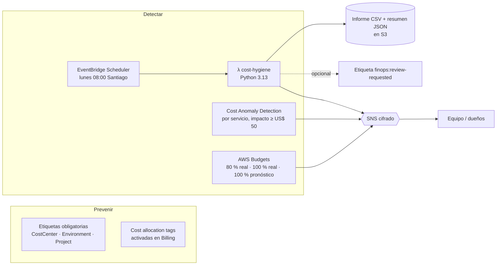

# 04 · FinOps: presupuestos, anomalías y escáner de recursos ociosos

FinOps no es "apagar lo que no se usa" una vez al año. Es tener **visibilidad continua**, **alertas antes de que llegue la factura** y **responsables** para cada gasto. Este proyecto automatiza las tres cosas.

> Requisitos del puesto que cubre: *Madurez en FinOps y eficiencia operativa*, *control de inventarios y gestión de costes*, *métricas claras*, *AWS Lambda (Python)*, *Terraform*.

## Componentes



## Qué detecta el escáner

| Hallazgo | Por qué cuesta dinero | Estimación |
|---|---|---|
| Volumen EBS sin adjuntar | Se cobra por GB aprovisionado, se use o no | GB × precio del tipo de volumen |
| Elastic IP sin asociar | Desde 2024 AWS cobra cada IPv4 pública por hora | US$ 0,005/h ≈ US$ 3,65/mes |
| Snapshot antiguo que no respalda ninguna AMI | Almacenamiento acumulado que nadie revisa | Cota superior (los snapshots son incrementales) |
| Instancia detenida > 14 días | No paga cómputo, pero sí sus volúmenes | Suma de sus volúmenes |
| Recurso sin etiquetas de coste | No se puede asignar a un equipo: nadie es responsable | — |

Principios:

- **Nunca borra nada.** Informa y, si se activa `tag_candidates`, etiqueta para que el dueño decida. Un borrado automático equivocado cuesta más que lo que ahorra.
- **Mínimo privilegio verificable**: el rol solo puede escribir **una** etiqueta concreta (`aws:TagKeys`); no puede modificar ni eliminar recursos.
- **Estimaciones honestas**: precios de lista configurables (`PRICES_JSON`), redondeo decimal y snapshots marcados como cota superior.
- **Multirregión**: revisa todas las regiones de `scan_regions` en una ejecución.

## Ejemplo de resumen semanal

```
Informe semanal de higiene de costes

Hallazgos: 7
Ahorro mensual estimado: US$ 52.30

  - long-stopped-instance: 1
  - missing-tags: 3
  - old-snapshot: 1
  - unassociated-eip: 1
  - unattached-volume: 1

Mayores oportunidades:
  - vol-0abc… (sa-east-1): 500 GiB gp3 sin adjuntar ~ US$ 40.00/mes
  ...
```

*(Ejemplo ilustrativo del formato; las cifras reales dependen de la cuenta.)*

## Pruebas

13 tests con `pytest` + `moto`, incluyendo los casos que más falsos positivos generan: EIP asociada, snapshot que respalda una AMI e instancia detenida recientemente.

```bash
pip install -r requirements-dev.txt && pytest -q
```

## Siguiente nivel de madurez

1. **CUR 2.0 → Athena + QuickSight**: coste por `CostCenter` y por unidad de negocio (coste por pedido, por cliente).
2. **Compute Optimizer** para *rightsizing* de EC2, EBS y Lambda con datos reales de uso.
3. **Savings Plans** solo después de estabilizar el *rightsizing*: comprometerse sobre una base inflada es pagar de más durante uno o tres años.
