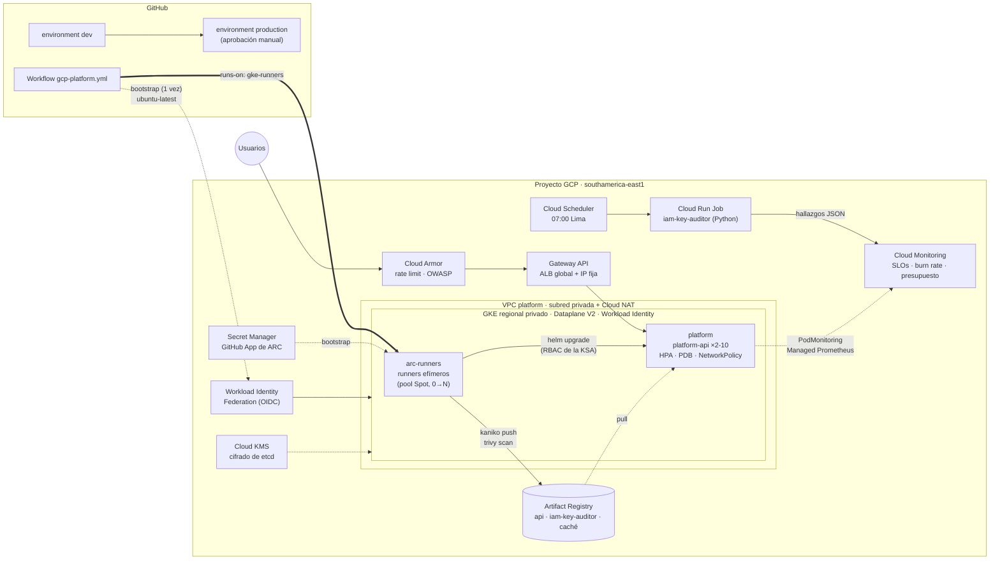

# 06 · Plataforma GKE con runners self-hosted de GitHub Actions (Google Cloud)

Un clúster **GKE privado y regional** gestionado con Terraform, en el que los propios runners de GitHub Actions (Actions Runner Controller sobre un pool Spot que escala a cero) construyen las imágenes con kaniko, las escanean con Trivy y despliegan la aplicación con Helm, **sin una sola clave de cuenta de servicio en todo el proyecto**: GitHub se federa con Workload Identity Federation y los Pods usan Workload Identity. Un job en Python audita a diario que siga siendo así.

> Requisitos que cubre (oferta *DevOps Engineer GCP*): *GCP en producción con IAM y redes* · *Kubernetes/GKE en producción* · *Terraform aplicado a GCP* · *GitHub Actions: runners self-hosted, secretos y entornos* · *Python para automatización*. Valorados: *Helm*, *seguridad de contenedores*, *observabilidad* y *resolución de incidentes*.

## Arquitectura



## Decisiones de diseño

| Problema | Solución | Por qué |
|---|---|---|
| Credenciales de GCP en GitHub | **Workload Identity Federation**: el token OIDC del workflow se intercambia por credenciales de 1 hora. El binding usa `attribute.repository_ref` = repo + rama | Nada que rotar ni filtrar. Un fork o una rama distinta de `main` no puede asumir la cuenta de bootstrap. Misma filosofía que el [ADR-0003](../../docs/adr/0003-github-oidc.md) en AWS |
| Runners de GitHub con acceso a un clúster privado | **ARC (Actions Runner Controller)** dentro del clúster: los runners despliegan con el token de su KSA y RBAC de namespace | Cero credenciales de clúster fuera de GCP; el único job en `ubuntu-latest` es el bootstrap, vía endpoint DNS autenticado con IAM |
| Construir imágenes sin Docker privilegiado | **kaniko** en modo kubernetes de ARC; autenticación en Artifact Registry por Workload Identity | Sin Docker-in-Docker ni Pods privilegiados; la misma herramienta que uso en la plataforma de un banco |
| Coste de los runners | Pool **Spot** con taint `dedicated=runners` y `minRunners: 0` | Sin trabajos, 0 nodos y 0 €; un runner que pierde su VM reintenta el job |
| Secretos de ARC (GitHub App) | **Secret Manager** → Secret de Kubernetes creado en el bootstrap | Los valores nunca pasan por el estado de Terraform ni por el repo |
| Tráfico de entrada | **Gateway API** (ALB global) + **Cloud Armor** (300 req/min por IP, OWASP SQLi/XSS, CVEs) + IP reservada | WAF y rate limiting delante del clúster; la IP no cambia aunque se recree el Gateway |
| Pods que hablan entre sí sin control | **NetworkPolicy** (Dataplane V2): ingress solo desde el balanceador y Managed Prometheus; egress solo DNS y metadata | El namespace `platform` queda aislado por defecto |
| Secretos de Kubernetes en claro en etcd | **CMEK**: clave propia en Cloud KMS con rotación de 90 días | Control del ciclo de vida de la clave que cifra los Secrets |
| Claves JSON de cuentas de servicio | **Auditor en Python** (Cloud Run Job diario) + política de organización opcional `iam.disableServiceAccountKeyCreation` | Detecta lo que no debería existir y, si se activa `enforce`, desactiva las vencidas |
| Alertas por umbrales fijos | **SLOs de Cloud Monitoring** (99,9 % disponibilidad, 95 % < 500 ms) con alertas por **burn rate** (14,4× en 1 h, 6× en 6 h) | Como en el [proyecto 05](../05-observability): se avisa cuando el presupuesto de error se gasta demasiado rápido, no por cada 5xx |
| Registro que crece sin fin | Políticas de limpieza de Artifact Registry: 10 versiones recientes y `latest-main` se conservan; sin etiqueta > 7 días y etiquetas > 90 días se borran | FinOps aplicado al registro |
| Despliegues sin cortes | `maxUnavailable: 0`, readiness que pasa a 503 al recibir SIGTERM y drena 5 s, PDB, `topologySpreadConstraints` por zona | El balanceador deja de enviar tráfico antes de que el proceso muera |

## Qué hay en cada carpeta

| Ruta | Contenido |
|---|---|
| `*.tf` | Red, GKE, IAM/WIF, registro, KMS, Secret Manager, observabilidad, presupuesto, auditor |
| `tests/platform.tftest.hcl` | 9 bloques de `terraform test` con proveedor simulado (sin credenciales) |
| `charts/api/` | Chart de Helm de `platform-api`: Deployment endurecido, HPA, PDB, NetworkPolicy, Gateway, HTTPRoute, HealthCheckPolicy, GCPBackendPolicy (Cloud Armor), PodMonitoring |
| `runners/` | Values de ARC, plantilla de hook, RBAC de la KSA de runners y [guía de la GitHub App](runners/README.md) |
| `src/platform_api/` | API FastAPI: `/healthz`, `/readyz` con drenado, `/metrics`, `/api/v1/whoami`, logs JSON para Cloud Logging con trace |
| `src/iam_key_auditor/` | Job de auditoría de claves user-managed (dry-run por defecto) |
| `runbooks/` | [Incidente tras un despliegue en GKE](runbooks/gke-incidente-despliegue.md) |
| `../../.github/workflows/gcp-platform.yml` | bootstrap → build (kaniko) → scan (Trivy) → deploy-dev → deploy-prod |

## Pruebas

- **Terraform**: `terraform test` con `mock_provider "google"`: clúster privado y endurecido, pools (Spot, taints, Secure Boot, cuenta mínima), red y NAT, identidad federada (owner, repo y rama), SLOs y burn rates, limpieza del registro y presupuesto, auditor en modo informe, WAF, y ausencia de recursos opcionales cuando no se configuran.
- **Python**: 48 tests con `pytest`. API: readiness durante el drenado, SIGTERM real, métricas por plantilla de ruta (sin explosión de cardinalidad), logs JSON con `httpRequest` y trace. Auditor: clasificación por edad, un hallazgo por clave, dry-run frente a enforce, resumen y códigos de salida.
- **Helm**: `helm lint --strict`, render con valores de dev y de producción, y `kubeconform` contra los esquemas de Kubernetes 1.31 en la CI.
- **Seguridad**: Checkov (96 checks; las 6 excepciones están justificadas junto al recurso), TFLint con el ruleset de Google, Trivy sobre cada imagen publicada.

```bash
cd projects/06-gcp-gke-platform
terraform init -backend=false && terraform test
python -m pytest
helm lint charts/api --strict
```

## Despliegue

Requisitos: proyecto de GCP con facturación, `gcloud` autenticado con permisos de Owner (o los roles equivalentes), Terraform ≥ 1.10, `gh`.

```bash
# 1. Bucket para el estado (una vez)
gcloud storage buckets create gs://tf-state-$PROJECT_ID --location=southamerica-east1 \
  --uniform-bucket-level-access --public-access-prevention
gcloud storage buckets update gs://tf-state-$PROJECT_ID --versioning

# 2. Infraestructura
cp terraform.tfvars.example terraform.tfvars   # edita project_id, alert_email, billing_account_id
terraform init -backend-config="bucket=tf-state-$PROJECT_ID"
terraform apply                                 # ~15 min (el clúster regional es lo más lento)

# 3. Variables del repositorio para el workflow (las imprime el output)
terraform output -raw github_cli_commands | bash

# 4. GitHub App de ARC → Secret Manager (ver runners/README.md), y después:
#    Actions → "GCP · Plataforma GKE" → Run workflow → bootstrap-runners

# 5. Primer despliegue: un push a main que toque este proyecto, o Run workflow → deploy.
terraform output gateway_ip                     # apunta aquí el DNS
```

Para HTTPS: crea un mapa de certificados en Certificate Manager y pasa `--set gateway.tls.certmap=<nombre>` (el workflow lo lee de `vars.GATEWAY_CERTMAP` si existe). Para Binary Authorization: `enable_binary_authorization = true` y una política que exija la atestación que genere la CI; está fuera del alcance de esta versión y documentado como siguiente paso.

## Coste orientativo (dev, 24×7, São Paulo)

| Partida | USD/mes aprox. |
|---|---|
| Plano de control GKE regional | 73 |
| 2 × e2-standard-2 (pool apps) | 155 |
| Cloud NAT (gateway + ~20 GB) | 35 |
| ALB global + Cloud Armor (5 reglas) | 30 |
| Runners Spot e2-standard-4 | ~0,06 por hora de CI efectiva |
| KMS, Artifact Registry, Cloud Run Job, Scheduler, Logging/Monitoring | < 10 |
| **Total** | **~300** |

Está pensado para desplegarse, probarse y destruirse: `terraform destroy` (con `deletion_protection = false`) tarda unos 10 minutos. Para dejarlo encendido con menos coste: `apps_machine_type = "e2-small"`, `apps_min_nodes = 1` (pierde la tolerancia a fallo de zona) y desactivar los flow logs.

## Siguientes pasos de madurez

1. **Binary Authorization** con atestación firmada en el job `scan` (solo imágenes escaneadas sin CRITICAL llegan a `platform`).
2. **Config Connector o GitOps (ArgoCD)** para que el estado deseado del clúster viva en Git y no solo en el workflow.
3. **Entornos separados** (`dev`/`prod` en namespaces o clústeres distintos) con `vars.GKE_NAMESPACE` por environment.
4. **Backup for GKE** y pruebas de restauración programadas.
